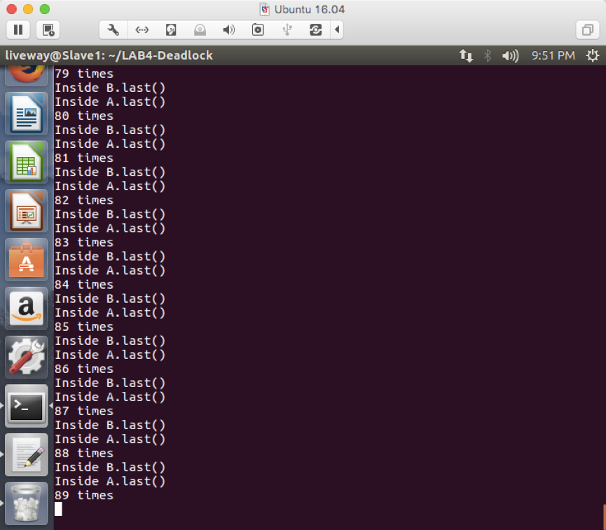

## 死锁(Deadlock)

1. ### 死锁的相关知识​

   1. #### 死锁的定义

      ​	死锁是指两个或两个以上的进程在执行过程中，由于竞争资源或者由于彼此通信而造成的一种阻塞的现象，若无外力作用，它们将无法进行下去。

      ​

   2. #### 产生死锁的原因

      1. 系统资源不足不足以满足诸多进程的需要，会引起进程对资源的竞争；

      2. 进程运行推进的顺序不合适；

      3. 资源分配不当。

         ​

   3. #### 产生死锁的四个必要条件

      1. 互斥条件：指进程对所分配到的资源进行排它性使用，在一段时间内某资源只由一个进程占用。如果此时还有其它进程请求资源，则请求者只能等待，直至占有资源的进程用毕释放，即一个资源每次只能被一个进程使用；

      2. 请求与保持条件：指进程已经保持至少一个资源，但又提出了新的资源请求，而该资源已被其它进程占有，此时请求进程阻塞，但又对自己已获得的其它资源保持不放；

      3. 不剥夺条件：指进程已获得的资源，在未使用完之前，不能被剥夺，只能在使用完时由自己释放；

      4. 循环等待条件：指在发生死锁时，必然存在一个进程——资源的环形链，即进程集合{P0，P1，P2，···，Pn}中的P0正在等待一个P1占用的资源；P1正在等待P2占用的资源，……，Pn正在等待已被P0占用的资源，若干进程之间形成一种首尾相接的循环等待资源关系。

         ​

   4. #### 死锁的预防和处理方法

      ##### 预防

      1. 在系统设计、进程调度等方面注意不让这四个必要条件成立；
      2. 确定资源合理分配算法，避免进程永久占据系统资源；
      3. 防止进程处于等待状态的情况下占用资源；
      4. 对进程发出的资源请求进行检查，根据检查结果决定是否分配资源。

      ##### 处理方法

      1.  预防死锁：破坏产生死锁的四个必要条件之一；

      2.  避免死锁：在资源动态分配过程中，用某种方法去防止系统进入不安全状态；

      3.  检测和解除死锁，检查到死锁状态，采取适当措施，从系统中将已发生的死锁清楚掉。

           ​

2. ### 程序产生死锁的解释

   先来看看我们这个程序：

   ##### 类A，类B的定义如下：

   ```java
   class A{
   	synchronized void methodA(B b){
   		b.last();
   	}
   	
   	synchronized void last(){
   		System.out.println("Inside A.last()");
   	}

   }

   class B{
   	synchronized void methodB(A a){
   		a.last();
   	}
   	
   	synchronized void last(){
   		System.out.println("Inside B.last()");
   	}

   }
   ```

   ​	在类A，类B中用了同步关键字synchronized，该关键字用来修饰一个方法或者一个代码块时，能够保证在同一时刻最多只有一个线程执行该段代码。当一个线程访问object的一个synchronized同步代码块或同步方法时，其他线程对object中所有其它synchronized同步代码块或同步方法的访问将被阻塞。也就是说在这里形成了产生死锁 的四个必要条件之一的互斥条件。

   ​	在类A的synchronized同步函数 methodA 中，调用了类B的synchronized同步函数 last ;在类B的synchronized同步函数 methodB 中，调用了类A的synchronized同步函数 last 。一旦两个线程分别同时进入类A、类B的synchronized同步函数 method，则会满足产生死锁的四个必要条件，进入死锁状态。

   ​

   ##### 主函数如下：

   ```java
   class Deadlock implements Runnable{
   	A a=new A();
   	B b=new B();

   	Deadlock(){//构造函数
   		Thread t = new Thread(this);
   		int count = 10000;
   		
   		t.start();//每次执行时，都会运行run()语句
   		while(count-->0);
   		a.methodA(b);
   	}
   	public void run(){
   		b.methodB(a);
   	}
   	
   	public static void main(String args[]){
   		new Deadlock();
   	}
   }
   ```

   ​	在主函数中，声明了类A，类B的两个变量分别为a，b。线程t执行时会运run()函数，run()函数中的 b.methodB(a) 语句就会执行类B中的synchronized同步代码块；在等待count个时钟周期后会执行类A中的synchronized同步代码块。若这两个线程同时进入类A、类B的synchronized同步函数 method，类A的synchronized同步函数 methodA在申请类B的synchronized同步函数 last ；类B的synchronized同步函数 methodB在申请类A的synchronized同步函数 last ；则会满足产生死锁的四个必要条件，进入死锁状态。

   ​

3. ### 产生死锁的截图

   ​	因为产生的死锁是随机的，以下是设置count=10时，在第八十九次的运行时进入了死锁状态，如下图所示：	

