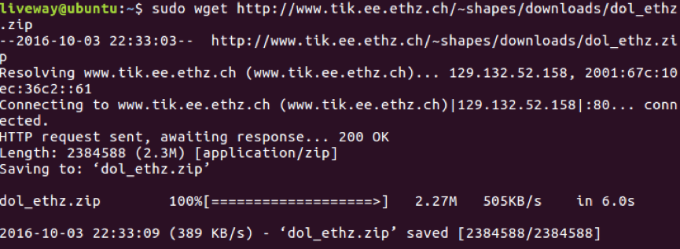

## 配置DOL的过程	

* **Description**

  **Distributed operation layer (DOL)** is a software development framework to program parallel applications. The DOL allows to specify applications based on the Kahn process network model of computation and features a simulation engine based on SystemC. Moreover, the DOL provides an XML-based specification format to describe the implementation of a parallel application on a multi-processor systems, including binding and mapping.

  ​

* **How to install**

  1. 安装必要环境：

     A.  安装之前更新源信息

     ```bash
     $  sudo apt-get update
     ```

     ​

     B.  安装基于Java的build工具Ant

     ```bash
     $  sudo apt-get install ant
     ```

     B 指令后的执行结果及验证结果如下：

     			

     ​

     C.  安装解扩展名为.zip的压缩文件

     ```bash
     $  sudo apt-get unzip 
     ```

     C 指令后的执行结果如下：

     

     ​

     D.	安装jdk-8u101-linux-i586

     D.a	解压安装包

     将安装包解压到/usr/lib/java

     ```BASH
     $  cd /usr/lib
     $  sudo mkdir java
     $  sudo tar zxvf ./jdk-8u101-linux-i586.gz -C /usr/lib/java 
     ```

     ​

     重命名

     ```bash
     $  cd /usr/lib/java
     $  sudo mv jdk1.8.0_101/ jdk8 
     ```

     ​

     D.b	配置环境变量

     打开文件

     ```bash
     $  gedit ~/.bashrc
     ```

      在文末添加如下语句

     	

     ​

     使刚刚添加的语句生效

     ```bash
     $   source ~/.bashrc
     ```

     ​

     D.c	配置默认JDK

     ```bash
     $  sudo update-alternatives --install /usr/bin/java java /usr/lib/java/jdk8/bin/java 300

     $  sudo update-alternatives --install /usr/bin/javac javac /usr/lib/java/jdk8/bin/javac 300

     ```

      指令后的执行结果如下：

     

     ​

     查看当前各种JDK版本和配置

     ```bash
     $  sudo update-alternatives --config java
     ```

      指令后的执行结果如下：

     

     ​

     查看JDK版本

     ```bash
     $  java -version 
     ```

     指令后的执行结果如下：

     	


2.   下载文件

     A.	下载systemc-2.3.1.tgz

     ```bash
     $  sudo wget http://www.accellera.org/images/downloads/standards/systemc/systemc-2.3.1.tgz
     ```

     systemc-2.3.1.tgz下载结果如下：

     

     ​

     B.	下载dol_ethz.zip

     ```bash
     $  sudo wget http://www.tik.ee.ethz.ch/~shapes/downloads/dol_ethz.zip
     ```

     dol_ethz.zip下载结果如下：

     

     ​

3.   解压文件

       A.	新建dol的文件夹 

     ```bash
       $  mkdir dol 
     ```

       ​

       B.	将dol_ethz.zip解压到dol文件夹中

     ```bash
       $  unzip dol_ethz.zip -d dol  
     ```

       ​

       C.	解压systemc

     ```bash
       $  tar -zxvf systemc-2.3.1.tgz
     ```

       ​

       ​

4.   编译systemc

       A.	解压后进入systemc-2.3.1的目录下

     ```bash
       $  cd systemc-2.3.1
     ```

       ​

       B.	新建一个临时文件夹objdir

     ```bash
       $  mkdir objdir
     ```

       ​

       C.	进入该文件夹objdir

     ```bash
       $  cd objdir 
     ```

       ​

       D.	运行configure(能根据系统的环境设置一下参数，用于编译)

     ```bash
       $  ../configure CXX=g++ --disable-async-updates  
     ```

       编译结果如下：

       

       ​	

       E.	编译并查看systems-2.3.1的文件目录

     ```bash
       $  sudo make install  
       $  ls
     ```

       systems-2.3.1的文件目录如下：

       

       ​	

       F.	输出当前工作路径

     ```bash
       $  pwd	
     ```

       当前工作路径如下：

       

       ​	

5.   编译dol

       A.	进入刚刚dol的文件夹

     ```BASH
       $  cd ../dol  
     ```

       ​

       B.	修改build_zip.xml文件

     ```bash
       $  sudo gedit build_zip.xml 
     ```

       ​

       找到下面这段话

       

       ​

       将路径更改为刚才的工作路径如下：

     ```java
       <property name="systemc.inc"value="/home/liveway/systemc-2.3.1/include"/>
       <property name="systemc.lib"value="/home/liveway/systemc-2.3.1/lib-linux/libsystemc.a"/>
     ```

       ​

       C.	编译

     ```BASH
       $  ant -f build_zip.xml all
     ```

       ​

       D.	进入build/bin/mian路径下并运行第一个例子

     ```bash
       $  cd build/bin/main  
       $  ant -f runexample.xml -Dnumber=1  
     ```

       运行成功的结果如下：

        

       ​

* **Experimental experience**

  ​	还记得上个学期操作系统重装了四次VMware和Ubuntu过程的煎熬，这个学期换了电脑，听到TA大大说这学期还需要用Ubuntu，我内心是拒绝的。

  ​	大概是因为第一次遇到并解决了各种bug，这次操作起来倒是非常顺利。TA大大的PPT非常详细，跟着PPT上的步骤依次进行就差不多可以完成实验了。但是可能我是因为版本的关系，不可以直接在Ubuntu里安装openjdk-7-jdk；不过TA大大早已知道我们会遇到各种困难，还为我们准备了DOL配置过程的TXT文件，所以根据TA大大TXT文件的解决方案，去另外下载了JDK的安装包，之后根据TXT文件和PPT比较顺利的完成了本次的DOL配置实验。

  ​	感觉这学期学的课程都很实用，get各种巧技能。这门课就get到了轻量级标记语言Markdown的语法，Markdown用简洁的语法代替排版，而不像一般我们用的字处理软件 Word 或 Pages 有大量的排版、字体设置，它使我们专心于码字，大大的节省我们的时间，而且导出格式可以满足作业要求，对于一周有七门实验报告要写的我们来说实在太适合不过了。而且这学期的作业在github上提交，学习使用github，学习借鉴github上的优秀代码及算法。

  ​

  ​

