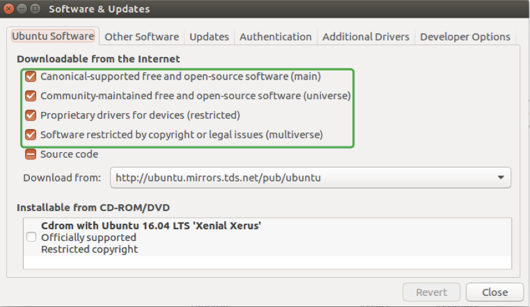

## Ubuntu 16.04 安装ROS 

1. ### Configure Ubuntu repositories

   开启Ubuntu的仓库的三个主要仓库：“restricted"、"universe"和"multiverse"，其中 “restricted" 是专用驱动程序的设备仓库；"universe" 是维护免费和开源软件的仓库；"multiverse" 是受版权或法律问题限制的软件仓库。

   在Ubuntu的system setting中找到software & updates，配置仓库如下图所示：

   

   ​

2. ### Setup sources.list

   安装源列表，使得Ubuntu能从packages.ros.org下载软件，如下：

   ```bash
   sudo sh -c 'echo "deb http://packages.ros.org/ros/ubuntu $(lsb_release -sc) main" > /etc/apt/sources.list.d/ros-latest.list'
   ```

   ​

3. ### Setup keys

   ```bash
   sudo apt-key adv --keyserver hkp://ha.pool.sks-keyservers.net:80 --recv-key 0xB01FA116
   ```

   ​

4. ### Installation

   1. 确保Debian软件包索引是最新的：

      ```bash
      sudo apt-get update
      ```

      ​

   2. 选择安装Desktop-Full Install:

      ```bash 
      sudo apt-get install ros-kinetic-desktop-full
      ```

      ​

   3. 搜索可利用的安装包

      ```bash
      apt-cache search ros-kinetic
      ```

      ​

5. ### Initialize rosdep

   rosdep可以让我们轻松地编译系统依赖项，和运行一些ROS核心组件。在使用ROS之前，初始化rosdep

   ```bash
   sudo rosdep init
   rosdep update
   ```

   ​

6. ### Environment setup

   在每次启动新shell时,ROS环境变量自动添加到bash会话中:

   ```bash
   echo "source /opt/ros/kinetic/setup.bash" >> ~/.bashrc
   source ~/.bashrc
   ```

   ​

7. ### Getting rosinstall

   rosinstall 是ROS中只用一个命令就能轻松下载ROS软件包的许多源代码的命令行工具：

   ```bash
   sudo apt-get install python-rosinstall
   ```

   ​

   以上就是安装ROS的过程，安装ROS比较简单，基本上按照教程走就可以安装好ROS了。


 