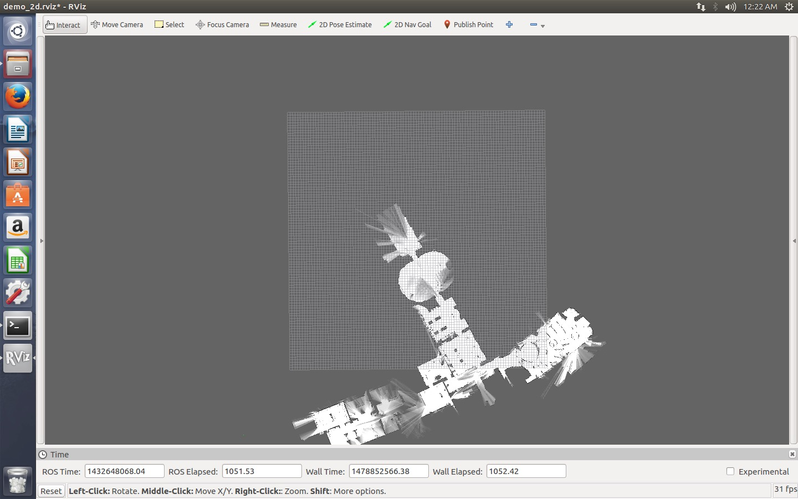
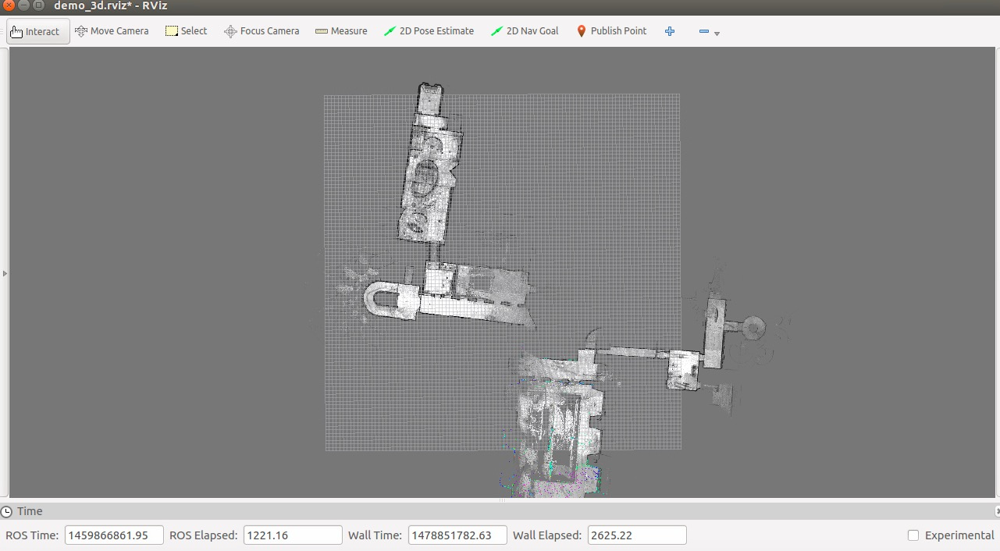
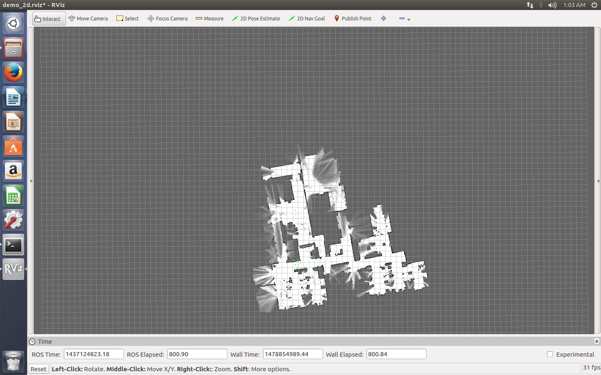

## 在ROS中使用Cartographer进行SLAM

### 简介

1. #### ROS

   ROS(Robot Operating System) 是一种用于编写机器人软件的灵活框架。 它是一个工具，库和约定的集合，旨在简化在各种机器人平台上创建复杂和健壮的机器人行为的任务。

   ​

2. #### Cartographer 

   Cartographer是google开源的通用2D和3D定位与地图同步构建的SLAM(simultaneous localization and mapping)工具，并提供ROS接口。


### 安装说明

1. 本次安装过程是基于Ubuntu16.04和ROS的安装和测试过程。
2. 本次安装过程主要参考以下资料：
   * Cartographer安装教程：https://google-cartographer-ros.readthedocs.io/en/latest/

   * ROS安装教程：http://wiki.ros.org/kinetic/Installation/Ubuntu

   * 博客链接1：http://blog.csdn.net/zhangrelay/article/details/5275757

   * 博客链接2：http://www.cnblogs.com/wenhust/p/5961017.html

     ​


### ROS安装过程

1. #### Configure Ubuntu repositories

   开启Ubuntu的仓库的三个主要仓库：“restricted"、"universe"和"multiverse"，其中 “restricted" 是专用驱动程序的设备仓库；"universe" 是维护免费和开源软件的仓库；"multiverse" 是受版权或法律问题限制的软件仓库。

   在Ubuntu的system setting中找到software & updates，配置仓库如下图所示：

   

   ​

2. #### Setup sources.list

   安装源列表，使得Ubuntu能从packages.ros.org下载软件，如下：

   ```bash
   sudo sh -c 'echo "deb http://packages.ros.org/ros/ubuntu $(lsb_release -sc) main" > /etc/apt/sources.list.d/ros-latest.list'
   ```

   ​

3. #### Setup keys

   ```bash
   sudo apt-key adv --keyserver hkp://ha.pool.sks-keyservers.net:80 --recv-key 0xB01FA116
   ```

   ​

4. #### Installation

   * 确保Debian软件包索引是最新的

     ```bash
     sudo apt-get update
     ```

     ​

   * 选择安装Desktop-Full Install:

     ```bash
     sudo apt-get install ros-kinetic-desktop-full
     ```

     ​

   * 搜索可利用的安装包

     ```bash
     apt-cache search ros-kinetic
     ```

     ​

5. #### Initialize rosdep

   rosdep可以让我们轻松地编译系统依赖项，和运行一些ROS核心组件。在使用ROS之前，初始化rosdep

   ```bash
   sudo rosdep init
   rosdep update
   ```

   ​

6. #### Environment setup

   在每次启动新shell时,ROS环境变量自动添加到bash会话中

   ```bash
   echo "source /opt/ros/kinetic/setup.bash" >> ~/.bashrc
   source ~/.bashrc
   ```

   ​

7. #### Getting rosinstall

   rosinstall 是ROS中只用一个命令就能轻松下载ROS软件包的许多源代码的命令行工具

   ```bash
   sudo apt-get install python-rosinstall
   ```

   以上就是Ubuntu16.04安装ROS的过程。

   ​

### Cartographer 安装过程

1. #### Install wstool and rosdep

   ```bash
   sudo apt-get update
   sudo apt-get install -y python-wstool python-rosdep ninja-build
   ```

   ​

2. #### Create a new workspace in 'catkin_ws'

   ```bash
   mkdir catkin_ws
   cd catkin_ws
   wstool init src
   ```

   ​

3. #### Merge the cartographer_ros.rosinstall file and fetch code for dependencies

   ```bash
   wstool merge -t src https://raw.githubusercontent.com/googlecartographer/cartographer_ros/master/cartographer_ros.rosinstall
   wstool update -t src
   ```

   ​

4. #### Install deb dependencies

   ```bash
   rosdep init
   rosdep update
   rosdep install --from-paths src --ignore-src --rosdistro=${ROS_DISTRO} -y
   ```

   ​

5. #### Build and install

   ```bash
   catkin_make_isolated --install --use-ninja
   source install_isolated/setup.bash
   ```

   如果在这一步报错，则可以按照以下方法解决：

   * 使用VPN，确保能上外网；

   * 手动安装ceres solver，安装过程如下：

     ```bash
     git clone https://github.com/hitcm/ceres-solver-1.11.0.git
     cd ceres-solver-1.11.0
     mkdir build
     cd build
     cmake .. -G Ninja
     ninja
     ninja test
     sudo ninja install
     ```

   ​

### 运行demo

在这里运行了官网提供的前三个demo：

1. #### demo1

   * Download the 2D backpack example bag.

     ```bash
     wget -P ~/Downloads https://storage.googleapis.com/cartographer-public-data/bags/backpack_2d/cartographer_paper_deutsches_museum.bag
     ```

     ​

   * Launch the 2D backpack demo.

     ```bash
     roslaunch cartographer_ros demo_backpack_2d.launch bag_filename:=${HOME}/Downloads/cartographer_paper_deutsches_museum.bag
     ```

     ​

   * Running result. 

     ​

2. #### demo2

   * Download the 3D backpack example bag.

     ```bash
     wget -P ~/Downloads https://storage.googleapis.com/cartographer-public-data/bags/backpack_3d/cartographer_3d_deutsches_museum.bag
     ```

     ​

   * Launch the 3D backpack demo.

     ```bash
     roslaunch cartographer_ros demo_backpack_3d.launch bag_filename:=${HOME}/Downloads/cartographer_3d_deutsches_museum.bag
     ```

     ​

   * Running result.

     

     ​

3. #### demo3

   * Download the Revo LDS example bag.

     ```bash
     wget -P ~/Downloads https://storage.googleapis.com/cartographer-public-data/bags/revo_lds/cartographer_paper_revo_lds.bag
     ```

     ​

   * Launch the Revo LDS demo.

     ```bash
     roslaunch cartographer_ros demo_revo_lds.launch bag_filename:=${HOME}/Downloads/cartographer_paper_revo_lds.bag
     ```

     ​

   * Running result.

     

     ​

   ​


​	

