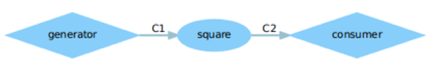
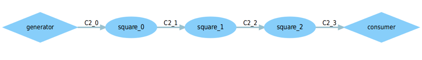
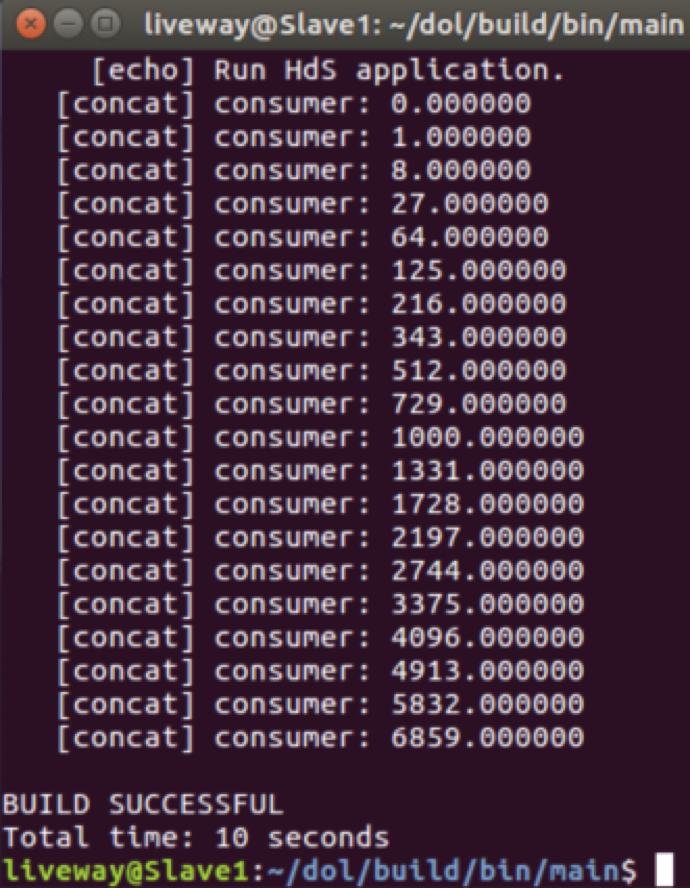
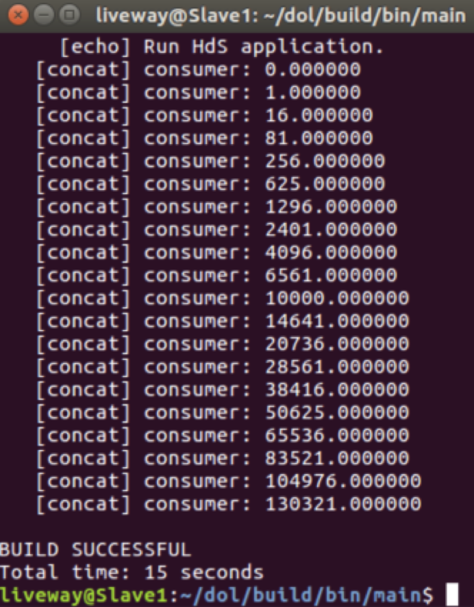

## DOL实例分析&编程

#### 实验任务

##### 	1.  修改example1，让其输出3次方数

##### 	2. 修改example2，让3个square模块变成2个

##### 

#### 实验相关文件

在修改example之前，我们先来了解example相关文件

1. ##### /src文件夹

   *.c与对应的.h文件：是实现的模块，是dot框框的功能描述。

   在/src文件夹中有consumer.c 和consumer.h、generator.c和generator.h、square.c和square.h及global.h文件。

   generator.h文件如下：在该文件中定义了结构体_local_states、初始化函数generator_init()、信号产生函数generator_fire()。

   ```c
   #ifndef GENERATOR_H
   #define GENERATOR_H

   #include <dol.h>
   #include "global.h"

   #define  PORT_OUT 10

   typedef struct _local_states {
       int index;
       int len;
   } Generator_State;

   void generator_init(DOLProcess *);
   int generator_fire(DOLProcess *);

   #endif
   ```

   ​

   generator.c文件如下：初始化函数generator_init()将当前位置置为0，设置长度；信号产生函数generator_fire()：如果当前位置小于设定长度，则将x写入到输出端，否则销毁进程。

   ```c
   #include <stdio.h>
   #include <string.h>

   #include "generator.h"

   // initialization function
   void generator_init(DOLProcess *p) { //初始化函数
       p->local->index = 0;
       p->local->len = LENGTH;
   }

   int generator_fire(DOLProcess *p) { //信号产生函数

       if (p->local->index < p->local->len) {
           float x = (float)p->local->index;
           DOL_write((void*)PORT_OUT, &(x), sizeof(float), p);//写数据
           p->local->index++;
       }

       if (p->local->index >= p->local->len) { //销毁进程
           DOL_detach(p);
           return -1;
       }

       return 0;
   }
   ```

   ​

   square.h文件如下：在该文件中定义了结构体_local_states、初始化函数square_init()、信号产生函数square_fire();

   ```c
   #ifndef SQUARE_H
   #define SQUARE_H

   #include <dol.h>
   #include "global.h"

   #define PORT_IN  0
   #define PORT_OUT 1

   typedef struct _local_states {
       int index;
       int len;
   } Square_State;

   void square_init(DOLProcess *);
   int square_fire(DOLProcess *);

   #endif
   ```

   ​

   square.c文件如下：初始化函数square_init()将当前位置置为0，设置长度；信号产生函数square_fire()：如果当前位置小于设定长度，则读出输入端的数值，做平方运算后写入输出端，否则销毁进程。根据该文件可知，将平方运算改为立方运算即可完成实验任务1。

   ```c++
   #include <stdio.h>

   #include "square.h"

   void square_init(DOLProcess *p) { //初始化函数
       p->local->index = 0;
       p->local->len = LENGTH;
   }

   int square_fire(DOLProcess *p) { //信号产生函数
       float i;

       if (p->local->index < p->local->len) {
           DOL_read((void*)PORT_IN, &i, sizeof(float), p); //读数据
           i = i*i; // 平方运算
           DOL_write((void*)PORT_OUT, &i, sizeof(float), p); //写数据
           p->local->index++;
       }

       if (p->local->index >= p->local->len) { //销毁进程
           DOL_detach(p);
           return -1;
       }

       return 0;
   }
   ```

   ​

   comsumer.h文件如下：在该文件中定义了结构体_local_states、初始化函数comsumer_init()、信号产生函数comsumer_fire();

   ```c
   #ifndef CONSUMER_H
   #define CONSUMER_H

   #include <dol.h>
   #include "global.h"

   #define PORT_IN 100

   typedef struct _local_states {
       char name[10];
       int index;
       int len;
   } Consumer_State;

   void consumer_init(DOLProcess *);
   int consumer_fire(DOLProcess *);

   #endif
   ```

   ​

   consumer.c文件如下：初始化函数consumer_init()将当前位置置为0，设置长度；信号产生函数consumer_fire()：如果当前位置小于设定长度，则读出输入端数据并打印，否则销毁进程。

   ```c
   #include <stdio.h>

   #include "consumer.h"

   void consumer_init(DOLProcess *p) { //初始化函数
       sprintf(p->local->name, "consumer");
       p->local->index = 0;
       p->local->len = LENGTH;
   }

   int consumer_fire(DOLProcess *p) {  //信号产生函数
       float c;
       if (p->local->index < p->local->len) {
           DOL_read((void*)PORT_IN, &c, sizeof(float), p); //读数据
           printf("%s: %f\n", p->local->name, c); //打印
           p->local->index++;
       }

       if (p->local->index >= p->local->len) { //销毁进程
           DOL_detach(p);
           return -1;
       }

       return 0;
   }

   ```

   ​

2. ##### ./example*.xml

   定义模块与模块之间是怎么连接的，有process（框）、sw_channel（线）、connection（）（连接框和线）

   example1.xml文件如下：我们可以看到process有三个对应三个.c或.h文件；sw_channel有两条线，对应C1,C2；connection有四个，因为每条线对应两个connection，将input端和ouput端连接起来。

   ```xml
   <?xml version="1.0" encoding="UTF-8"?>
   <processnetwork 
   xmlns="http://www.tik.ee.ethz.ch/~shapes/schema/PROCESSNETWORK" 
   xmlns:xsi="http://www.w3.org/2001/XMLSchema-instance" 
   xsi:schemaLocation="http://www.tik.ee.ethz.ch/~shapes/schema/PROCESSNETWORK
       http://www.tik.ee.ethz.ch/~shapes/schema/processnetwork.xsd" name="example1"> 

     <!-- processes -->
     <process name="generator"> 
       <port type="output" name="1"/>
       <source type="c" location="generator.c"/>
     </process>

     <process name="consumer"> 
       <port type="input" name="1"/> 
       <source type="c" location="consumer.c"/>
     </process>

     <process name="square"> 
       <port type="input" name="1"/>
       <port type="output" name="2"/>
       <source type="c" location="square.c"/>
     </process>

     <!-- sw_channels -->
     <sw_channel type="fifo" size="10" name="C1">
       <port type="input" name="0"/>
       <port type="output" name="1"/>
     </sw_channel>

     <sw_channel type="fifo" size="10" name="C2">
       <port type="input" name="0"/>
       <port type="output" name="1"/>
     </sw_channel>

     <!-- connections -->
     <connection name="g-c">
       <origin name="generator">
         <port name="1"/>
       </origin>
       <target name="C1">
         <port name="0"/>
       </target>
     </connection>

     <connection name="c-c">
       <origin name="C2">
         <port name="1"/>
       </origin>
       <target name="consumer">
         <port name="1"/>
       </target>
     </connection>

     <connection name="s-c">
       <origin name="square">
         <port name="2"/>
       </origin>
       <target name="C2">
         <port name="0"/>
       </target>
     </connection>

     <connection name="c-s">
       <origin name="C1">
         <port name="1"/>
       </origin>
       <target name="square">
         <port name="1"/>
       </target>
     </connection>

   </processnetwork>
   ```

   ​

   example2.xml文件如下：example2.xml与example1.xml大致相同，不同的是在第9行，定义了一个迭代次数N，用来迭代生成square 模块和将square连接起来。在连接是迭代部分包括nput端和ouput端。根据该文件可知，将迭代次数3改为2，即可完成实验任务2。

   ```xml
   <?xml version="1.0" encoding="UTF-8"?>
   <processnetwork xmlns="http://www.tik.ee.ethz.ch/~shapes/schema/PROCESSNETWORK" xmlns:xsi="http://www.w3.org/2001/XMLSchema-instance" xsi:schemaLocation="http://www.tik.ee.ethz.ch/~shapes/schema/PROCESSNETWORK
   http://www.tik.ee.ethz.ch/~shapes/schema/processnetwork.xsd" name="example2"> 

     <!-- iterator number -->
     <variable value="3" name="N"/> 

     <!-- instantiate resources -->
     <process name="generator">
       <port type="output" name="10"/>
       <source type="c" location="generator.c"/>
     </process>

     <iterator variable="i" range="N">
       <process name="square">
         <append function="i"/>
         <port type="input" name="0"/>
         <port type="output" name="1"/>
         <source type="c" location="square.c"/>
       </process>
     </iterator>

     <process name="consumer">
       <port type="input" name="100"/>
       <source type="c" location="consumer.c"/>
     </process>

     <iterator variable="i" range="N + 1">
       <sw_channel type="fifo" size="10" name="C2">
         <append function="i"/>
         <port type="input" name="0"/>
         <port type="output" name="1"/>
       </sw_channel>
     </iterator>

     <!-- instantiate connection -->
     <iterator variable="i" range="N">
       <connection name="to_square">
         <append function="i"/>
         <origin name="C2">
           <append function="i"/>
           <port name="1"/>
         </origin>
         <target name="square">
           <append function="i"/>
           <port name="0"/>
         </target>
       </connection>

       <connection name="from_square">
           <append function="i"/>
           <origin name="square">
             <append function="i"/>
             <port name="1"/>
           </origin>
           <target name="C2">
             <append function="i + 1"/>
             <port name="0"/>
           </target>
       </connection>
     </iterator>

     <connection name="g_">
       <origin name="generator">
        <port name="10"/>
       </origin>
       <target name="C2"> 
         <append function="0"/>
         <port name="0"/>
       </target>
     </connection>

     <connection name="_c">
       <origin name="C2">
         <append function="N"/>
         <port name="1"/>
       </origin>
       <target name="consumer">
         <port name="100"/>
       </target>
     </connection>

   </processnetwork>
   ```

   ​

3. ##### example的dot图

   下图为example1的dot图，process对应同名的.c和.h文件；sw_channel对应C1和C2；connection将线和框连接起来。

   

   ​

   下图为example2的dot图，process对应同名的.c和.h文件；sw_channel对应C1和C2；connection将线和框连接起来。由dot图可知，通过迭代生成了三个square模块。

   ​

   #### 完成实验任务

   ##### 1. 修改example1

   通过以上分析，可知修改./example1/src文件夹中的square.c文件中的对输出端数据运算将平方运算改为立方运算，即可完成实验任务。以下为修改的代码：

   ```c
   int square_fire(DOLProcess *p) { //信号产生函数
       float i;

       if (p->local->index < p->local->len) {
           DOL_read((void*)PORT_IN, &i, sizeof(float), p); //读数据
           //修改此处，将平方运算改为立方运算  
           //i = i*i; // 平方运算
           i = i*i*i; // 立方运算
           DOL_write((void*)PORT_OUT, &i, sizeof(float), p); //写数据
           p->local->index++;
       }

       if (p->local->index >= p->local->len) { //销毁进程
           DOL_detach(p);
           return -1;
       }
   ```

   ​

   ##### 2. 修改example2

   通过以上分析，可知修改./example2文件夹中的example2.xml文件将迭代次数3改为2即可完成实验任务。以下为修改的代码：

   ```xml
     <!-- iterator number -->
     <!-- <variable value="3" name="N"/> -->
     <variable value="3" name="N"/>
   ```

   ​

#### 实验结果截图

##### 1. 修改后example1的运行结果

generator产生0-19的整数，square对generator产生的整数进行立方操作，consumer输出实验结果，如下图：因为在本实验中，没有将square进行更名，故而修改前的dot图与修改后的一致，在此不再截图。

 


##### 2.修改后example2的运行结果

generator产生0-19的整数，square对generator产生的整数2次进行平方操作，consumer输出实验结果，如下图：

 


##### 3.修改后example2的dot图

 下图为修改后example2的dot图，process对应同名的.c和.h文件；sw_channel对应C1和C2；connection将线和框连接起来。由dot图可知，通过迭代生成了2个square模块。


#### 实验感想

实验课PPT很详细，TA大大上课很认真，本来让人一脸懵逼的代码在TA大大的讲解下变得清晰简单起来。在了解了代码文件以后，自己就可以很快速的根据实验要求找到关键代码，进行相应修改完成任务。在这次实验中，知道了dot图的相关知识：

1. process（框）：对应同名的.c和.h文件，在.c文件中定义了该process的功能。
2. sw_channel（线）：连接两个process的线，通过这条线将多个process的功能联合起来。
3. connection（连接线和框）：将sw_channel的端口和process的端口连接起来，每条sw_channel要有两个connection，使得sw_channel有效。

了解了实验相关文件后，实现起来很顺利，希望接下来的实验也能像这次一样。

